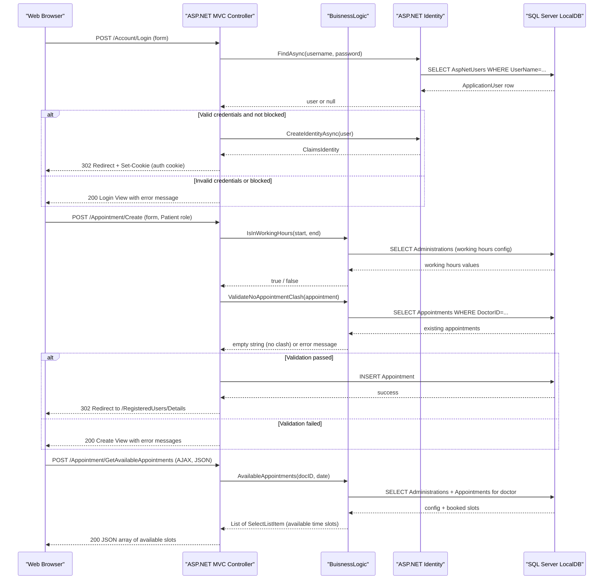

# API & Service Communication Contracts

The GreenHospital application exposes 28 server-rendered HTML endpoints through a monolithic ASP.NET MVC 5 application, plus one JSON AJAX endpoint for appointment scheduling. All communication is synchronous HTTP; there are no async messaging patterns or inter-service calls.

## Service Catalog

| Service | Port | Category | Purpose |
|---------|------|----------|---------|
| DoctorPatient Web App | 49398 (IIS Express) | Business | Single monolithic ASP.NET MVC web application serving all hospital management features for patients, doctors, and administrators |

## API Endpoints Inventory

| Controller | Method | Path | Request Type | Response Type | Auth |
|-----------|--------|------|-------------|--------------|------|
| HomeController | GET | / | — | HTML View | Anonymous |
| HomeController | GET | /Home/About | — | HTML View | Anonymous |
| HomeController | GET | /Home/Contact | — | HTML View | Anonymous |
| AccountController | GET | /Account/Login | returnUrl (query) | HTML View | Anonymous |
| AccountController | POST | /Account/Login | LoginViewModel (form) | Redirect / HTML View | Anonymous |
| AccountController | GET | /Account/Register | — | HTML View | Anonymous |
| AccountController | POST | /Account/Register | RegisterViewModel (form) | Redirect / HTML View | Anonymous |
| AccountController | GET | /Account/Manage | ManageMessageId (query) | HTML View | Authenticated |
| AccountController | POST | /Account/Manage | ManageUserViewModel (form) | Redirect / HTML View | Authenticated |
| AccountController | POST | /Account/LogOff | — | Redirect | Authenticated |
| DoctorController | GET | /Doctor/Index | docDept, searchstring (query) | HTML View | Anonymous |
| DoctorController | GET | /Doctor/Availability/{id} | id (path) | HTML View | Anonymous |
| DoctorController | GET | /Doctor/UpcomingAppointments/{id} | id (path), SearchString (query) | HTML View | Admin, Doctor |
| DoctorController | GET | /Doctor/History/{id} | id (path) | HTML View | Admin, Doctor |
| DoctorController | GET | /Doctor/Create | — | HTML View | Admin |
| DoctorController | POST | /Doctor/Create | DoctorModel (form) | Redirect / HTML View | Admin |
| DoctorController | GET | /Doctor/Edit/{id} | id (path) | HTML View | Admin, Doctor |
| DoctorController | POST | /Doctor/Edit/{id} | DoctorModel (form) | Redirect / HTML View | Admin, Doctor |
| DoctorController | GET | /Doctor/Delete/{id} | id (path) | HTML View | Admin |
| DoctorController | POST | /Doctor/Delete/{id} | id (form) | Redirect | Admin |
| AppointmentController | GET | /Appointment/Index | — | HTML View | Admin |
| AppointmentController | GET | /Appointment/Details/{id} | id (path) | HTML View | Authenticated |
| AppointmentController | GET | /Appointment/Create | — | HTML View | Patient |
| AppointmentController | POST | /Appointment/Create | AppointmentModel (form) | Redirect / HTML View | Patient |
| AppointmentController | GET | /Appointment/Edit/{id} | id (path) | HTML View | Admin, Patient |
| AppointmentController | POST | /Appointment/Edit/{id} | AppointmentModel (form) | Redirect / HTML View | Authenticated |
| AppointmentController | GET | /Appointment/Delete/{id} | id (path) | HTML View | Authenticated |
| AppointmentController | POST | /Appointment/Delete/{id} | id (form) | Redirect | Authenticated |
| AppointmentController | POST | /Appointment/GetAvailableAppointments | docID, date (JSON body) | JSON (SelectListItem array) | Anonymous |
| AdministrationController | GET | /Administration/Index | — | HTML View | Admin |
| AdministrationController | GET | /Administration/Edit/{id} | id (path) | HTML View | Admin |
| AdministrationController | POST | /Administration/Edit/{id} | AdministrationModel (form) | Redirect / HTML View | Admin |
| RegisteredUsersController | GET | /RegisteredUsers/Index | — | HTML View | Admin |
| RegisteredUsersController | GET | /RegisteredUsers/Details | — | HTML View | Authenticated |
| RegisteredUsersController | GET | /RegisteredUsers/Edit/{id} | id (path, username) | HTML View | Admin |
| RegisteredUsersController | POST | /RegisteredUsers/Edit | EditUserViewModel (form) | Redirect / HTML View | Admin |
| RegisteredUsersController | GET | /RegisteredUsers/Delete/{id} | id (path, username) | HTML View | Admin, Patient |
| RegisteredUsersController | POST | /RegisteredUsers/Delete | id (form) | Redirect | Admin, Patient |
| RegisteredUsersController | GET | /RegisteredUsers/UserRoles/{id} | id (path, username) | HTML View | Admin |
| RegisteredUsersController | POST | /RegisteredUsers/UserRoles | SelectUserRolesViewModel (form) | Redirect | Admin |
| ErrorController | GET | /Error/General | — | HTML View | Anonymous |
| ErrorController | GET | /Error/HttpError404 | — | HTML View | Anonymous |

## Management & Observability Endpoints

| Service | Endpoint | Notes |
|---------|---------|-------|
| DoctorPatient Web App | None | No health check, metrics, or Swagger/OpenAPI endpoints are configured |

No actuator, health check (`/health`, `/healthz`), Swagger UI, or metrics endpoints are present. There is no observability infrastructure.

## DTOs & Contracts

The application uses ASP.NET MVC model binding with EF entity classes and a small set of ViewModels as request/response contracts:

- **LoginViewModel** — Request body for `POST /Account/Login`; carries username, password, and remember-me flag
- **RegisterViewModel** — Request body for `POST /Account/Register`; carries registration fields and exposes a `GetUser()` factory method
- **ManageUserViewModel** — Request body for `POST /Account/Manage`; carries old and new password fields
- **EditUserViewModel** — Request/response model for user editing; wraps `ApplicationUser` with appointments list
- **SelectUserRolesViewModel** — Request model for `POST /RegisteredUsers/UserRoles`; carries username and a list of role selections
- **AppointmentDateGroupViewModel** — ViewModel that groups appointments by date for display
- **AppointmentModel** — EF entity used directly as form binding model for appointment create/edit endpoints
- **DoctorModel** — EF entity used directly as form binding model for doctor create/edit endpoints
- **AdministrationModel** — EF entity used directly as form binding model for settings edit endpoint

EF entities are used directly as MVC model-binding targets (no separate DTO/API layer). There are no OpenAPI/Swagger specifications, protobuf schemas, or GraphQL schemas. JSON serialization uses the MVC 5 default (Newtonsoft.Json 5.0.6) only for the `GetAvailableAppointments` AJAX endpoint; all other responses are HTML.

## Communication Patterns

**Synchronous only**: All communication is synchronous HTTP request/response between the browser and the monolithic ASP.NET MVC application. There are no inter-service calls, message queues, event-driven patterns, or gRPC.

**No API gateway**: The application is a single monolith; there is no gateway or reverse proxy configured.

**No resilience patterns**: No circuit breaker, retry policy, timeout configuration, or bulkhead patterns are implemented. Database failures surface directly as unhandled exceptions.

**No service discovery**: The application connects directly to a SQL Server LocalDB instance via a hardcoded connection string (`DefaultConnection`) in `Web.config`.

**Security posture**: Cookie-based forms authentication is implemented via ASP.NET Identity 2.1 and OWIN middleware. Role-based authorization (Admin, Doctor, Patient) is enforced using `[Authorize(Roles = "...")]` attributes on individual controller actions. Anti-forgery tokens (`[ValidateAntiForgeryToken]`) are applied on all state-mutating POST endpoints. There is no HTTPS/TLS enforcement configured in `Web.config` or OWIN startup — the application runs over plain HTTP by default. No JWT, OAuth2 resource server, or API-level authentication is present (the OAuth providers are configured for external login only). No API versioning scheme is implemented.

## Service Technology Matrix

| Service | Web Framework | Data Access | Discovery | Gateway | Health Checks | Cache | Metrics |
|---------|-------------|------------|----------|---------|--------------|-------|---------|
| DoctorPatient Web App | ASP.NET MVC 5.2 | Entity Framework 6.1 | None | None | None | None | None |

## Service Communication Sequence

