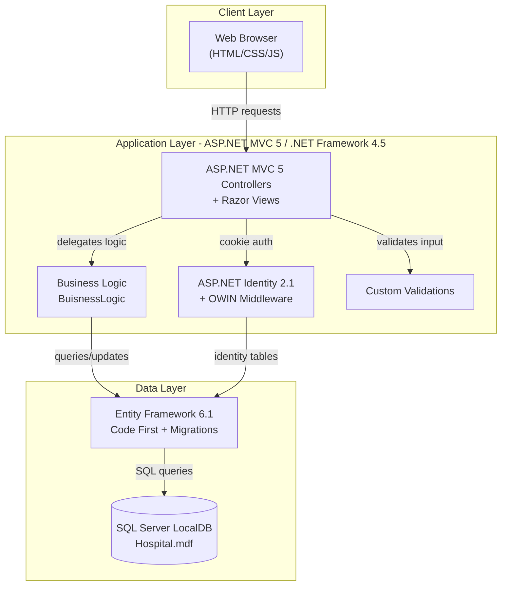
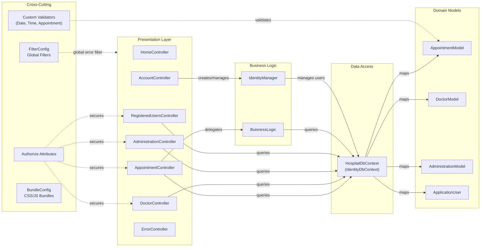

# Architecture Diagram

This document describes the architecture of the GreenHospital (DoctorPatient) application — an ASP.NET MVC 5 hospital management system built on .NET Framework 4.5.

## Application Architecture

### Technology Stack Summary

| Layer | Technology | Version | Purpose |
|-------|-----------|---------|---------|
| Presentation | ASP.NET MVC | 5.2.0 | Server-side MVC web framework |
| Presentation | Razor Views | 3.2.0 | Server-side HTML templating |
| Presentation | Bootstrap | 3.0.0 | CSS framework and responsive UI |
| Presentation | jQuery | 1.10.2 | Client-side scripting |
| Authentication | ASP.NET Identity | 2.1.0 | User identity and role management |
| Authentication | Microsoft OWIN | 2.1.0 | Cookie-based authentication middleware |
| Business Logic | C# / .NET Framework | 4.5 | Core application runtime |
| Data Access | Entity Framework | 6.1.0 | ORM and database migrations |
| Data Storage | SQL Server LocalDB | v11.0 | Relational database (Hospital.mdf) |
| Utilities | TimePeriodLibrary.NET | 2.0.0 | Appointment time-slot calculation |
| Serialization | Newtonsoft.Json | 5.0.6 | JSON serialization |

### Data Storage & External Services

The application uses a single SQL Server LocalDB instance (Hospital.mdf) accessed through Entity Framework 6 Code First. The database stores all domain entities: ApplicationUser (identity), DoctorModel, AppointmentModel, and AdministrationModel. There are no external message brokers, caches, or third-party API integrations; the system is entirely self-contained. OWIN security providers for Facebook, Google, Twitter, and Microsoft Account are referenced but not actively configured in the current codebase.

### Key Architectural Decisions

- **Direct DbContext access in controllers and business logic**: Controllers and `BuisnessLogic` instantiate `HospitalDbContext` directly without a repository abstraction layer, resulting in tight coupling between the presentation/business logic layers and Entity Framework.
- **Role-based authorization**: ASP.NET Identity roles (Admin, Doctor, Patient) are enforced via `[Authorize(Roles = "...")]` attributes on controller actions to control access to hospital features.
- **OWIN pipeline for authentication**: Cookie-based authentication is configured via OWIN middleware in `Startup.Auth.cs`, enabling the use of external OAuth providers.

## Component Relationships

### Component Inventory

| Component | Layer | Type | Responsibility |
|-----------|-------|------|---------------|
| HomeController | Presentation | MVC Controller | Serves home, about, and contact pages |
| AccountController | Presentation | MVC Controller | Handles user registration, login, logout, and password management |
| AppointmentController | Presentation | MVC Controller | CRUD for appointments; AJAX endpoint for available time slots |
| DoctorController | Presentation | MVC Controller | CRUD for doctor profiles; doctor availability and appointment history |
| AdministrationController | Presentation | MVC Controller | Manages hospital administration settings (working hours, appointment duration) |
| RegisteredUsersController | Presentation | MVC Controller | Manages registered users and role assignments |
| ErrorController | Presentation | MVC Controller | Handles HTTP 404 and general error pages |
| BuisnessLogic | Business Logic | Static Helper Class | Working-hours validation, appointment clash detection, available time-slot calculation |
| IdentityManager | Business Logic | Manager Class | User creation, role assignment, and identity operations |
| HospitalDbContext | Data Access | EF DbContext | Database context exposing DbSets for all domain entities |
| AppointmentModel | Domain Model | EF Entity | Appointment entity with doctor, patient, date, and time |
| DoctorModel | Domain Model | EF Entity | Doctor entity with name, specialty, and availability flag |
| AdministrationModel | Domain Model | EF Entity | Key-value settings store for hospital configuration |
| ApplicationUser | Domain Model | Identity Entity | ASP.NET Identity user extended with hospital-specific fields |
| MyAppointmentDateValidation | Cross-Cutting | Validation Attribute | Ensures appointment date is in the future |
| MyBirthDateValidation | Cross-Cutting | Validation Attribute | Ensures birth date is valid and in the past |
| MyTimeValidation | Cross-Cutting | Validation Attribute | Validates time format for appointment scheduling |
| FilterConfig | Cross-Cutting | App Start | Registers global MVC action filters (HandleErrorAttribute) |
| BundleConfig | Cross-Cutting | App Start | Configures CSS and JavaScript bundles for optimization |
| RouteConfig | Cross-Cutting | App Start | Defines URL routing rules (default: {controller}/{action}/{id}) |
