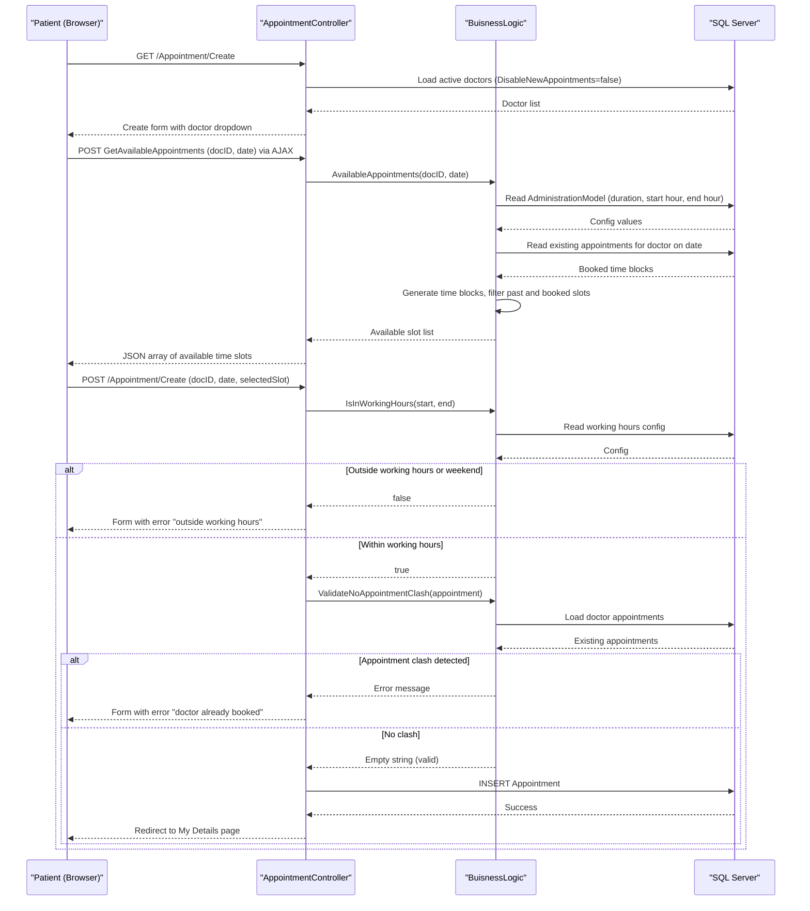

# Core Business Workflows

The GreenHospital application manages hospital appointments, enabling patients to self-register and book appointments with doctors across multiple departments, while administrators manage doctors, users, and hospital configuration settings.

## Domain Entities

| Entity | Service / Bounded Context | Description | Key Relationships |
|--------|--------------------------|-------------|------------------|
| ApplicationUser (Patient) | Identity & Patient Management | A registered hospital patient who can book and manage their own appointments | Has many Appointments; belongs to one or more Roles |
| Doctor | Medical Staff Management | A hospital doctor with a department, degree, and availability flag | Has many Appointments; belongs to one HospitalDepartment |
| Appointment | Appointment Scheduling | A scheduled time slot linking a specific patient to a specific doctor on a given date and time | Belongs to one ApplicationUser (patient) and one Doctor |
| AdministrationModel | Hospital Configuration | Key-value settings controlling appointment duration (minutes), working hours start, and working hours end | Read by all scheduling logic; writable only by Admin role |
| Role (Admin / Doctor / Patient) | Identity & Authorization | System roles that gate access to features; a user may hold multiple roles | Assigned to ApplicationUsers; enforced by Authorize attributes |

## Service-to-Domain Mapping

The application is a single monolith with no microservice boundaries. All domain contexts are owned and operated by the single `DoctorPatient` web application.

| Service | Domain Context | Owned Entities | External Dependencies |
|---------|--------------|---------------|----------------------|
| DoctorPatient Web App | Patient Management | ApplicationUser, Appointments | ASP.NET Identity for auth |
| DoctorPatient Web App | Medical Staff Management | Doctor, Appointments | None |
| DoctorPatient Web App | Appointment Scheduling | Appointment, AdministrationModel | TimePeriodLibrary.NET for time-block calculations |
| DoctorPatient Web App | Hospital Configuration | AdministrationModel | None |
| DoctorPatient Web App | Identity & Authorization | Roles, ApplicationUser | ASP.NET Identity, OWIN cookie auth |

## Primary Workflows

### Workflow 1: Patient Self-Registration

A new user visits the registration page, provides credentials and personal details, and the system creates a patient account automatically assigned to the "Patient" role.

**Steps:**
1. User navigates to `/Account/Register`
2. User fills in username, password (confirmed), full name, birth date, and sex
3. On submit, `MyBirthDateValidation` checks birth date is not in the future
4. ASP.NET Identity creates the user record with a hashed password
5. `IdentityManager.AddUserToRole` assigns the new user to the "Patient" role
6. User is automatically signed in with a session cookie
7. Redirect to Home/Index

**Business Rules Involved:** BirthDate must be in the past; password minimum 6 characters; username uniqueness enforced by Identity.

---

### Workflow 2: Patient Books an Appointment

A patient selects a doctor and a date, the system calculates available time slots based on working hours and existing appointments, and the patient selects a slot to book.

**Steps:**
1. Patient navigates to `/Appointment/Create` (requires "Patient" role)
2. System loads active doctors (where `DisableNewAppointments == false`) for selection
3. Patient selects a doctor and a date; AJAX call to `GetAvailableAppointments` fires
4. `BuisnessLogic.AvailableAppointments` reads working hours (from `AdministrationModel` IDs 2 & 3) and appointment duration (ID 1) from the database
5. The logic generates time blocks covering the working day, filters out past slots and slots overlapping booked appointments, and returns available time strings
6. Patient selects a time slot and submits the form
7. On submit, `BuisnessLogic.IsInWorkingHours` validates the selected slot is within working hours and not on a weekend
8. `BuisnessLogic.ValidateNoAppoinmentClash` checks that no appointment already exists for the same doctor at the same date/time
9. If all validations pass, the appointment is saved; redirect to `/RegisteredUsers/Details`
10. If validation fails, the form is re-displayed with error messages

**Business Rules Involved:** Appointments only on weekdays within configured working hours; no overlapping appointments for the same doctor; no appointments in the past; `DisableNewAppointments` flag on doctor blocks new bookings.

---

### Workflow 3: Admin Manages Hospital Configuration

An administrator adjusts appointment duration and working hours through the Administration UI, and these settings take effect immediately for all subsequent appointment calculations.

**Steps:**
1. Admin navigates to `/Administration/Index` (requires "Admin" role)
2. System displays all `AdministrationModel` records (appointment duration, working hours start, working hours end)
3. Admin clicks Edit for a setting (`/Administration/Edit/{id}`)
4. Admin updates the value and submits
5. The updated value is saved to the database
6. All future calls to `BuisnessLogic` read the new values directly from the database

---

### Workflow 4: Admin Manages Doctor Profiles

Administrators create, edit, and deactivate doctor profiles. Setting `DisableNewAppointments = true` prevents patients from booking new appointments with that doctor.

**Steps:**
1. Admin navigates to `/Doctor/Create` or `/Doctor/Edit/{id}`
2. Admin provides doctor name, birth date, sex, department (Surgery, Neurology, etc.), and degree (MBBS, FCPS, Diploma, FRCPS)
3. `MyBirthDateValidation` checks birth date is not in the future
4. On save, the doctor record is created or updated
5. If `DisableNewAppointments` is checked, the doctor no longer appears in the appointment booking dropdown

---

### Workflow 5: Admin Manages User Roles and Account Status

Administrators can change a user's roles (between Admin, Doctor, Patient) or block an account to prevent login.

**Steps:**
1. Admin navigates to `/RegisteredUsers/Index`, selects a user
2. To change roles: Admin navigates to `/RegisteredUsers/UserRoles/{username}`; system displays all available roles with current selections
3. Admin toggles role checkboxes and submits; `IdentityManager.ClearUserRoles` removes all existing roles, then adds the newly selected roles
4. To block a user: Admin edits the user via `/RegisteredUsers/Edit/{username}` and sets `Blocked = true`
5. On next login attempt, the `AccountController` checks `user.Blocked == true` and displays "Account has been blocked by Admin"

## Cross-Service Data Flows

The application is a monolith with no inter-service communication. All data flows are intra-application:

- **Appointment scheduling** uses `AdministrationModel` configuration data (fetched from the same database) to determine working hours and slot duration — this is the key cross-domain data flow within the application.
- **Doctor availability** is linked to appointment booking: `DisableNewAppointments` on `DoctorModel` gates whether the doctor appears in the patient's booking dropdown.
- **User identity and appointments** are co-located: `ApplicationUser` has a direct navigation property to their `Appointments` list, allowing `RegisteredUsersController` to display a patient's full appointment history.

There are no circuit breaker fallbacks, microservice aggregation patterns, or event-driven cross-context flows.

## Business Workflow Sequence

## Business Rules & Decision Logic

### Validation Rules

| Rule | Applies To | Constraint |
|------|-----------|-----------|
| MyBirthDateValidation | ApplicationUser, DoctorModel | Birth date must be in the past (not today or future) |
| MyAppointmentDateValidation | AppointmentModel | Appointment date must be today or in the future |
| MyTimeValidation | Time fields | Time format validation (currently disabled in AppointmentModel) |
| Password length | Registration, password change | Minimum 6 characters, maximum 100 |
| Name length | ApplicationUser, DoctorModel | Minimum 3 characters, maximum 60 |
| Username uniqueness | ApplicationUser | Enforced by ASP.NET Identity |
| ConfirmPassword match | Registration, password change | Must match the new password field |

### Business Constraints & Decision Logic

| Rule | Where Applied | Logic |
|------|-------------|-------|
| Weekday-only appointments | BuisnessLogic.IsInWorkingHours | Saturday and Sunday are rejected regardless of time |
| Working-hours constraint | BuisnessLogic.IsInWorkingHours | Appointment slot must fall entirely within configured start and end hours |
| No-past-appointments | BuisnessLogic.AvailableAppointments | Time blocks in the past are skipped; only future slots are offered |
| No double-booking | BuisnessLogic.ValidateNoAppoinmentClash | No two appointments for the same doctor at the same date and time |
| Doctor availability flag | AppointmentController, BuisnessLogic | Doctors with DisableNewAppointments=true are excluded from booking dropdowns |
| Blocked user cannot log in | AccountController.Login | If user.Blocked == true, login is rejected with an error message |
| Role-based access control | All controllers via Authorize attributes | Admin can do everything; Doctor can view/manage own appointments; Patient can book/manage own appointments |

### Authorization Rules

| Role | Permitted Actions |
|------|-----------------|
| Admin | Full access to all features: manage doctors, users, appointments, administration settings, role assignments |
| Doctor | View own upcoming appointments and appointment history; edit own profile |
| Patient | Create, view, edit, and delete own appointments; view and delete own account |
| Anonymous | View doctor list and availability; register; log in |

### Transaction Boundaries

Entity Framework 6 wraps each `SaveChanges()` call in an implicit database transaction. There are no explicit `TransactionScope` or `@Transactional`-equivalent annotations. Multi-step operations (e.g., clear roles then add new roles in `IdentityManager`) are not wrapped in a single transaction — a failure mid-sequence could leave the user with no roles.

### Error Handling

- Validation failures return the submitted form view with `ModelState` errors displayed to the user
- 404 errors redirect to `/Error/HttpError404` via IIS custom error configuration
- General errors redirect to `/Error/General` via ASP.NET custom errors configuration
- No business-specific exception types or compensating actions are implemented
- No audit trail or business event logging is configured
