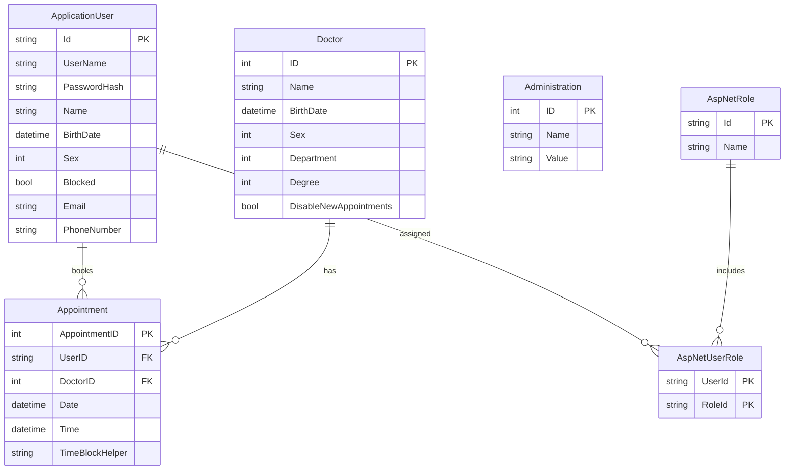

# Data Architecture & Persistence Layer

The GreenHospital application uses a single SQL Server LocalDB database accessed through Entity Framework 6.1 Code First, with four domain entities and the full ASP.NET Identity table set.

## Database Configuration

| Service / Module | DB Type | Profile | Driver | Connection | Migration Tool |
|-----------------|---------|---------|--------|-----------|---------------|
| DoctorPatient (all) | SQL Server LocalDB v11.0 | All (single profile) | System.Data.SqlClient (EF SqlServer 6.1.0) | AttachDbFilename: `|DataDirectory|\Hospital.mdf`; Integrated Security; MultipleActiveResultSets=true | EF6 Code First Migrations with `AutomaticMigrationsEnabled=true` |

Schema management is handled by Entity Framework 6 automatic migrations at application startup. The `Configuration.cs` seed method populates the three `AdministrationModel` rows (appointment duration, working hours start/end) and creates default roles (Admin, Doctor, Patient) and an initial Admin user on first run. There is no Flyway, Liquibase, or other migration tool. For full connection string property details, see `configuration-inventory.md`.

## Data Ownership per Service

| Service | Tables Owned | ORM Framework | Caching | Notes |
|---------|-------------|--------------|---------|-------|
| DoctorPatient Web App | Appointments, Doctors, Administrations, AspNetUsers (extended), AspNetRoles, AspNetUserRoles, AspNetUserLogins, AspNetUserClaims | Entity Framework 6.1 (Code First) | None | Single monolith; all tables in one shared database. ASP.NET Identity tables managed by `IdentityDbContext` base class. |

## Entity Model

## Key Repository Methods

The application does not define repository interfaces or classes. All data access is performed directly against `HospitalDbContext` within controllers and `BuisnessLogic`. The table below documents the key query patterns used:

| Component | Access Point | Key Query Patterns | Purpose |
|-----------|-------------|-------------------|---------|
| AppointmentController | `HospitalDbContext.Appointments` | `db.Appointments.Include(a => a.Doctor).OrderByDescending(a => a.Date)` | Load all appointments with doctor for admin index view |
| AppointmentController | `HospitalDbContext.Appointments` | `db.Appointments.Find(id)` | Fetch single appointment by PK |
| AppointmentController | `HospitalDbContext.Appointments.Add` + `SaveChanges` | Insert new appointment | Create appointment |
| AppointmentController | `db.Entry(appointment).State = Modified` + `SaveChanges` | Update appointment, preserving UserID | Edit appointment |
| AppointmentController | `db.Appointments.Remove` + `SaveChanges` | Delete appointment | Cancel appointment |
| DoctorController | `HospitalDbContext.Doctors` | Filter by `Name.Contains(searchstring)` and `Department.ToString() == docDept` | Doctor search and department filter |
| BuisnessLogic | `HospitalDbContext.Administrations.Find(id)` | Lookup by PK (IDs 1, 2, 3) for config values | Read appointment duration and working hours |
| BuisnessLogic | `HospitalDbContext.Appointments.Where(x => x.DoctorID == doctorID)` | Filter appointments per doctor | Clash detection and available slot calculation |
| RegisteredUsersController | `HospitalDbContext.ApplicationUsers` | `.First(u => u.UserName == id)` | Fetch user by username |
| AccountController | `UserManager.FindAsync(username, password)` | Identity API | Authenticate user |
| AccountController | `UserManager.CreateAsync(user, password)` | Identity API | Register new user |
| IdentityManager | `RoleManager.Create`, `UserManager.AddToRole` | Identity API | Manage roles and role assignments |

## Caching Strategy

No caching layer is configured. The application makes direct synchronous database calls for every request with no in-memory cache, distributed cache (Redis), or EF second-level cache. Frequently read configuration data (`AdministrationModel` rows with IDs 1, 2, 3) is queried on every call to `BuisnessLogic.IsInWorkingHours` and `AvailableAppointments`, creating repeated round-trips that could be avoided with even a simple in-memory cache.

## Data Ownership Boundaries

All data is stored in a single SQL Server LocalDB database (`Hospital.mdf`) shared by the single monolithic application. There is no database-per-service or schema-per-service separation. The `HospitalDbContext` inherits from `IdentityDbContext`, which means ASP.NET Identity tables (AspNetUsers, AspNetRoles, AspNetUserRoles, AspNetUserLogins, AspNetUserClaims) are co-located with the domain tables (Doctors, Appointments, Administrations) in the same database.

All data access is performed by directly instantiating `HospitalDbContext` inside controllers and the `BuisnessLogic` class — there is no repository abstraction or unit-of-work pattern. This means the entire application is effectively a single data owner with no enforced bounded context.

Cross-service data access is not applicable; all data access is intra-application. Read/write patterns are CRUD with no CQRS separation.

### Data Classification & Sensitivity

| Entity | Sensitive Fields | Classification | Controls in Place |
|--------|----------------|---------------|-------------------|
| ApplicationUser (AspNetUsers) | Name, BirthDate, Sex, Email, PhoneNumber, UserName | PII | Passwords hashed via ASP.NET Identity (PBKDF2). No encryption-at-rest, no field-level masking, no data anonymization. LocalDB file (Hospital.mdf) has no encryption. |
| Doctor | Name, BirthDate, Sex | PII | No encryption-at-rest or masking configured. |
| Appointment | UserID (FK to patient), DoctorID, Date, Time | PII (links patient identity to appointment) | No encryption-at-rest or masking configured. |
| Administration | Name, Value (configuration key-value pairs) | Internal | No sensitive data (working hours, appointment duration only). |

**Summary**: The application stores PII (patient names, birthdates, sex, contact info) and appointment records that link patient identity to medical visit timing. No encryption-at-rest, data masking, or field-level access controls are configured. The LocalDB `.mdf` file is stored on the local filesystem with no transparent data encryption (TDE) or file-system-level encryption enforced by the application.
