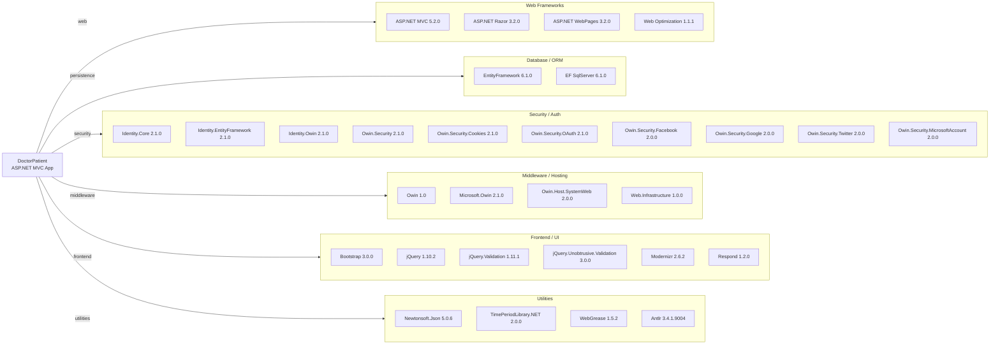

# Dependency Map

The GreenHospital (DoctorPatient) application declares 31 external dependencies managed through `packages.config` targeting .NET Framework 4.5.

## Dependencies

### Dependency Summary

| Category | Count | Key Libraries | Notes |
|----------|-------|--------------|-------|
| Web Frameworks | 4 | ASP.NET MVC 5.2.0, Razor 3.2.0, WebPages 3.2.0, Web Optimization 1.1.1 | Legacy MVC stack on .NET Framework 4.5 |
| Database / ORM | 2 | EntityFramework 6.1.0, EF SqlServer 6.1.0 | EF6 Code First; separate migration path to EF Core required |
| Security / Auth | 10 | ASP.NET Identity 2.1.0, OWIN Security 2.1.0, OAuth social providers | Multiple social OAuth providers included but not all actively configured |
| Middleware / Hosting | 4 | Owin 1.0, Microsoft.Owin 2.1.0, Owin.Host.SystemWeb 2.0.0 | System.Web-based OWIN host — incompatible with ASP.NET Core pipeline |
| Frontend / UI | 6 | Bootstrap 3.0.0, jQuery 1.10.2, jQuery.Validation 1.11.1 | All frontend libraries are very old; embedded in project (not CDN) |
| Utilities | 4 | Newtonsoft.Json 5.0.6, TimePeriodLibrary.NET 2.0.0, WebGrease, Antlr | Newtonsoft.Json is very old; WebGrease/Antlr are build-time bundling helpers |

### Version & Compatibility Risks

The application targets .NET Framework 4.5, which reached end-of-life in January 2016 and is no longer supported. All primary frameworks are significantly outdated: ASP.NET MVC 5.2.0 and ASP.NET Identity 2.1.0 are Framework-only and have no direct upgrade to ASP.NET Core without a rewrite. Entity Framework 6.1.0 has a migration path to EF Core but requires API changes. Newtonsoft.Json 5.0.6 (released 2013) is many major versions behind the current 13.x release and has known security-related fixes in intermediate versions. jQuery 1.10.2 and Bootstrap 3.0.0 are both well past end-of-life and have known security vulnerabilities. The OWIN host adapter (`Microsoft.Owin.Host.SystemWeb`) is incompatible with the Kestrel-based ASP.NET Core pipeline and must be replaced entirely during any modernization effort.

### Notable Observations

- **No logging framework declared**: The project has no structured logging library (Serilog, NLog, log4net) — it likely relies on `System.Diagnostics.Trace` or no logging at all, which is a gap for cloud-readiness and observability.
- **Four social OAuth providers included but appear unconfigured**: `Microsoft.Owin.Security.Facebook`, `.Google`, `.Twitter`, and `.MicrosoftAccount` are declared as dependencies but the application keys/secrets are not configured in `Web.config`, making them non-functional placeholders.
- **Frontend assets embedded in project**: Bootstrap, jQuery, and related scripts are stored directly in the `Scripts/` folder rather than loaded from a CDN or managed by a modern frontend tool (npm/webpack), which increases repository size and complicates upgrades.
- **Antlr and WebGrease are indirect bundling dependencies**: These are pulled in by `Microsoft.AspNet.Web.Optimization` for CSS/JS bundling and are not directly used by application code. They will be obsolete after migration to ASP.NET Core, which uses different asset pipeline tooling.

## Test Dependencies

No test-scope dependencies detected.

Total test-scope dependencies: 0

The project contains no test projects or test framework references (e.g., xUnit, NUnit, MSTest, Moq). This is a significant gap — there is no automated test coverage, which increases migration risk and makes it harder to verify correctness after modernization.
