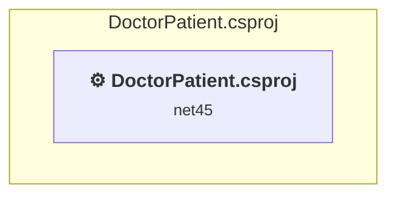

# Projects and dependencies analysis

This document provides a comprehensive overview of the projects and their dependencies in the context of upgrading to .NETCoreApp,Version=v10.0.

## Table of Contents

- [Executive Summary](#executive-Summary)
  - [Highlevel Metrics](#highlevel-metrics)
  - [Projects Compatibility](#projects-compatibility)
  - [Package Compatibility](#package-compatibility)
  - [API Compatibility](#api-compatibility)
  - [Binding Redirect Configuration](#binding-redirect-configuration)
- [Aggregate NuGet packages details](#aggregate-nuget-packages-details)
- [Top API Migration Challenges](#top-api-migration-challenges)
  - [Technologies and Features](#technologies-and-features)
  - [Most Frequent API Issues](#most-frequent-api-issues)
- [Projects Relationship Graph](#projects-relationship-graph)
- [Project Details](#project-details)

  - [DoctorPatient.csproj](#doctorpatientcsproj)

## Executive Summary

### Highlevel Metrics

| Metric | Count | Status |
| :--- | :---: | :--- |
| Total Projects | 1 | All require upgrade |
| Total NuGet Packages | 29 | 20 need upgrade |
| Total Code Files | 63 |  |
| Total Code Files with Incidents | 14 |  |
| Total Lines of Code | 3772 |  |
| Total Number of Issues | 113 |  |
| Estimated LOC to modify | 57+ | at least 1.5% of codebase |

### Projects Compatibility

| Project | Target Framework | Difficulty | Package Issues | API Issues | Binding Issues | Est. LOC Impact | Description |
| :--- | :---: | :---: | :---: | :---: | :---: | :---: | :--- |
| [DoctorPatient.csproj](#doctorpatientcsproj) | net45 | 🔴 High | 40 | 57 | 1 | 57+ | Wap, Sdk Style = False |

### Package Compatibility

| Status | Count | Percentage |
| :--- | :---: | :---: |
| ✅ Compatible | 9 | 31.0% |
| ⚠️ Incompatible | 15 | 51.7% |
| 🔄 Upgrade Recommended | 5 | 17.2% |
| ***Total NuGet Packages*** | ***29*** | ***100%*** |

### API Compatibility

| Category | Count | Impact |
| :--- | :---: | :--- |
| 🔴 Binary Incompatible | 31 | High - Require code changes |
| 🟡 Source Incompatible | 26 | Medium - Needs re-compilation and potential conflicting API error fixing |
| 🔵 Behavioral change | 0 | Low - Behavioral changes that may require testing at runtime |
| ✅ Compatible | 943 |  |
| ***Total APIs Analyzed*** | ***1000*** |  |

### Binding Redirect Configuration

| Severity | Count | Description |
| :--- | :---: | :--- |
| 🟡Potential | 1 | May cause issues in certain scenarios |
| ***Total Binding Issues*** | ***1*** | ***Across 1 project(s)*** |

## Aggregate NuGet packages details

| Package | Current Version | Suggested Version | Projects | Description |
| :--- | :---: | :---: | :--- | :--- |
| Antlr | 3.4.1.9004 |  | [DoctorPatient.csproj](#doctorpatientcsproj) | Needs to be replaced with Replace with new package Antlr4=4.6.6 |
| bootstrap | 3.0.0 | 5.3.8 | [DoctorPatient.csproj](#doctorpatientcsproj) | NuGet package contains security vulnerability |
| EntityFramework | 6.1.0 | 6.5.2 | [DoctorPatient.csproj](#doctorpatientcsproj) | NuGet package upgrade is recommended |
| jQuery | 1.10.2 | 3.7.1 | [DoctorPatient.csproj](#doctorpatientcsproj) | NuGet package contains security vulnerability |
| jQuery.Validation | 1.11.1 | 1.21.0 | [DoctorPatient.csproj](#doctorpatientcsproj) | NuGet package contains security vulnerability |
| Microsoft.AspNet.Identity.Core | 2.1.0 |  | [DoctorPatient.csproj](#doctorpatientcsproj) | ⚠️NuGet package is incompatible |
| Microsoft.AspNet.Identity.EntityFramework | 2.1.0 |  | [DoctorPatient.csproj](#doctorpatientcsproj) | ⚠️NuGet package is incompatible |
| Microsoft.AspNet.Identity.Owin | 2.1.0 |  | [DoctorPatient.csproj](#doctorpatientcsproj) | ⚠️NuGet package is incompatible |
| Microsoft.AspNet.Mvc | 5.2.0 |  | [DoctorPatient.csproj](#doctorpatientcsproj) | NuGet package functionality is included with framework reference |
| Microsoft.AspNet.Razor | 3.2.0 |  | [DoctorPatient.csproj](#doctorpatientcsproj) | NuGet package functionality is included with framework reference |
| Microsoft.AspNet.Web.Optimization | 1.1.1 |  | [DoctorPatient.csproj](#doctorpatientcsproj) | ⚠️NuGet package is incompatible |
| Microsoft.AspNet.WebPages | 3.2.0 |  | [DoctorPatient.csproj](#doctorpatientcsproj) | NuGet package functionality is included with framework reference |
| Microsoft.jQuery.Unobtrusive.Validation | 3.0.0 |  | [DoctorPatient.csproj](#doctorpatientcsproj) | ✅Compatible |
| Microsoft.Owin | 2.1.0 |  | [DoctorPatient.csproj](#doctorpatientcsproj) | ⚠️NuGet package is incompatible |
| Microsoft.Owin.Host.SystemWeb | 2.0.0 |  | [DoctorPatient.csproj](#doctorpatientcsproj) | ⚠️NuGet package is incompatible |
| Microsoft.Owin.Security | 2.1.0 |  | [DoctorPatient.csproj](#doctorpatientcsproj) | ⚠️NuGet package is incompatible |
| Microsoft.Owin.Security.Cookies | 2.1.0 |  | [DoctorPatient.csproj](#doctorpatientcsproj) | ⚠️Replace with Microsoft.AspNetCore.Authentication.Cookies: Use AddAuthentication().AddCookie() in Startup; adjust cookie options |
| Microsoft.Owin.Security.Facebook | 2.0.0 |  | [DoctorPatient.csproj](#doctorpatientcsproj) | ⚠️NuGet package is incompatible |
| Microsoft.Owin.Security.Google | 2.0.0 |  | [DoctorPatient.csproj](#doctorpatientcsproj) | ⚠️NuGet package is incompatible |
| Microsoft.Owin.Security.MicrosoftAccount | 2.0.0 |  | [DoctorPatient.csproj](#doctorpatientcsproj) | ⚠️NuGet package is incompatible |
| Microsoft.Owin.Security.OAuth | 2.1.0 |  | [DoctorPatient.csproj](#doctorpatientcsproj) | ⚠️Replace with Microsoft.AspNetCore.Authentication.JwtBearer: Use JWT Bearer for token validation; adopt IdentityServer or Azure AD for issuing tokens |
| Microsoft.Owin.Security.Twitter | 2.0.0 |  | [DoctorPatient.csproj](#doctorpatientcsproj) | ⚠️NuGet package is incompatible |
| Microsoft.Web.Infrastructure | 1.0.0.0 |  | [DoctorPatient.csproj](#doctorpatientcsproj) | NuGet package functionality is included with framework reference |
| Modernizr | 2.6.2 |  | [DoctorPatient.csproj](#doctorpatientcsproj) | ✅Compatible |
| Newtonsoft.Json | 5.0.6 | 13.0.4 | [DoctorPatient.csproj](#doctorpatientcsproj) | NuGet package upgrade is recommended |
| Owin | 1.0 |  | [DoctorPatient.csproj](#doctorpatientcsproj) | ⚠️NuGet package is incompatible |
| Respond | 1.2.0 |  | [DoctorPatient.csproj](#doctorpatientcsproj) | ✅Compatible |
| TimePeriodLibrary.NET | 2.0.0 | 2.1.6 | [DoctorPatient.csproj](#doctorpatientcsproj) | ⚠️NuGet package is incompatible |
| WebGrease | 1.5.2 |  | [DoctorPatient.csproj](#doctorpatientcsproj) | ✅Compatible |

## Top API Migration Challenges

### Technologies and Features

| Technology | Issues | Percentage | Migration Path |
| :--- | :---: | :---: | :--- |
| ASP.NET Framework (System.Web) | 57 | 100.0% | Legacy ASP.NET Framework APIs for web applications (System.Web.*) that don't exist in ASP.NET Core due to architectural differences. ASP.NET Core represents a complete redesign of the web framework. Migrate to ASP.NET Core equivalents or consider System.Web.Adapters package for compatibility. |

### Most Frequent API Issues

| API | Count | Percentage | Category |
| :--- | :---: | :---: | :--- |
| T:System.Web.Routing.RouteValueDictionary | 7 | 12.3% | Binary Incompatible |
| P:System.Web.Routing.RouteData.Values | 7 | 12.3% | Binary Incompatible |
| M:System.Web.Routing.RouteValueDictionary.Add(System.String,System.Object) | 7 | 12.3% | Binary Incompatible |
| T:System.Web.HttpContext | 3 | 5.3% | Source Incompatible |
| P:System.Web.HttpApplication.Context | 3 | 5.3% | Source Incompatible |
| T:System.Web.HttpServerUtility | 3 | 5.3% | Source Incompatible |
| P:System.Web.HttpApplication.Server | 3 | 5.3% | Source Incompatible |
| M:System.Web.HttpException.GetHttpCode | 2 | 3.5% | Source Incompatible |
| M:System.Web.HttpServerUtility.GetLastError | 2 | 3.5% | Source Incompatible |
| P:System.Web.HttpContext.IsCustomErrorEnabled | 2 | 3.5% | Binary Incompatible |
| T:System.Web.Routing.RouteCollection | 2 | 3.5% | Binary Incompatible |
| T:System.Web.HttpContextWrapper | 1 | 1.8% | Source Incompatible |
| M:System.Web.HttpContextWrapper.#ctor(System.Web.HttpContext) | 1 | 1.8% | Source Incompatible |
| T:System.Web.Routing.RequestContext | 1 | 1.8% | Binary Incompatible |
| M:System.Web.Routing.RequestContext.#ctor(System.Web.HttpContextBase,System.Web.Routing.RouteData) | 1 | 1.8% | Binary Incompatible |
| M:System.Web.HttpServerUtility.ClearError | 1 | 1.8% | Source Incompatible |
| T:System.Web.Routing.RouteData | 1 | 1.8% | Binary Incompatible |
| M:System.Web.Routing.RouteData.#ctor | 1 | 1.8% | Binary Incompatible |
| T:System.Web.HttpResponse | 1 | 1.8% | Source Incompatible |
| P:System.Web.HttpApplication.Response | 1 | 1.8% | Source Incompatible |
| M:System.Web.HttpResponse.Clear | 1 | 1.8% | Source Incompatible |
| T:System.Web.HttpException | 1 | 1.8% | Source Incompatible |
| M:System.Web.HttpException.#ctor(System.Int32,System.String,System.Exception) | 1 | 1.8% | Source Incompatible |
| T:System.Web.Routing.RouteTable | 1 | 1.8% | Binary Incompatible |
| P:System.Web.Routing.RouteTable.Routes | 1 | 1.8% | Binary Incompatible |
| M:System.Web.HttpApplication.#ctor | 1 | 1.8% | Source Incompatible |
| T:System.Web.HttpApplication | 1 | 1.8% | Source Incompatible |

## Projects Relationship Graph

Legend:
📦 SDK-style project
⚙️ Classic project

## Project Details

### DoctorPatient.csproj

#### Project Info

- **Current Target Framework:** net45
- **Proposed Target Framework:** net10.0
- **SDK-style**: False
- **Project Kind:** Wap
- **Dependencies**: 0
- **Dependants**: 0
- **Number of Files**: 94
- **Number of Files with Incidents**: 14
- **Lines of Code**: 3772
- **Estimated LOC to modify**: 57+ (at least 1.5% of the project)

#### Dependency Graph

Legend:
📦 SDK-style project
⚙️ Classic project

### API Compatibility

| Category | Count | Impact |
| :--- | :---: | :--- |
| 🔴 Binary Incompatible | 31 | High - Require code changes |
| 🟡 Source Incompatible | 26 | Medium - Needs re-compilation and potential conflicting API error fixing |
| 🔵 Behavioral change | 0 | Low - Behavioral changes that may require testing at runtime |
| ✅ Compatible | 943 |  |
| ***Total APIs Analyzed*** | ***1000*** |  |

#### Binding Redirect Configuration

| Rule | Severity | Details | Recommendation |
| :--- | :---: | :--- | :--- |
| Binding redirect forces version downgrade | 🟡Potential | Binding redirect for Microsoft.AspNet.Identity.Core targets 2.0.0.0 but package provides 2.1.0 | Update the binding redirect newVersion to match the version provided by the NuGet package. |

#### Project Technologies and Features

| Technology | Issues | Percentage | Migration Path |
| :--- | :---: | :---: | :--- |
| ASP.NET Framework (System.Web) | 57 | 100.0% | Legacy ASP.NET Framework APIs for web applications (System.Web.*) that don't exist in ASP.NET Core due to architectural differences. ASP.NET Core represents a complete redesign of the web framework. Migrate to ASP.NET Core equivalents or consider System.Web.Adapters package for compatibility. |

