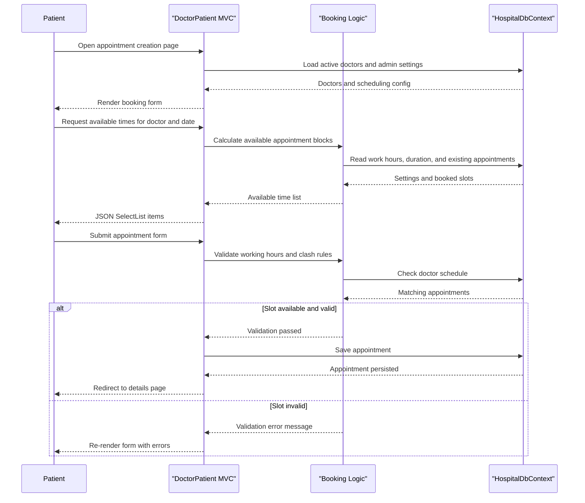

# API & Service Communication Contracts

The application exposes a browser-oriented MVC surface rather than a versioned REST API, with most requests returning HTML views and one JSON endpoint supporting appointment slot lookup. All communication is synchronous and stays within a single deployable web application backed by a local database.

## Service Catalog

| Service | Port | Category | Purpose |
|---|---:|---|---|
| `DoctorPatient` | 49398 (IIS Express dev setting) | API Layer | Serves patient, doctor, and administrator web flows through ASP.NET MVC controllers |

## API Endpoints Inventory

| Service | Method | Path | Request Type | Response Type |
|---|---|---|---|---|
| DoctorPatient / HomeController | GET | `/Home/Index` | none | Razor view |
| DoctorPatient / HomeController | GET | `/Home/About` | none | `List<AppointmentDateGroupViewModel>` rendered in view |
| DoctorPatient / HomeController | GET | `/Home/Contact` | none | Razor view |
| DoctorPatient / AccountController | GET | `/Account/Login` | `returnUrl` query parameter | Razor view |
| DoctorPatient / AccountController | POST | `/Account/Login` | `LoginViewModel` form body | Redirect or validation errors in view |
| DoctorPatient / AccountController | GET | `/Account/Register` | none | Razor view |
| DoctorPatient / AccountController | POST | `/Account/Register` | `RegisterViewModel` form body | Redirect or validation errors in view |
| DoctorPatient / AccountController | GET / POST | `/Account/Manage` | `ManageUserViewModel` on POST | Razor view or redirect |
| DoctorPatient / AppointmentController | GET | `/Appointment/Create` | none | `AppointmentModel` view model |
| DoctorPatient / AppointmentController | POST | `/Appointment/Create` | bound `AppointmentModel` fields | Redirect or validation errors in view |
| DoctorPatient / AppointmentController | POST | `/Appointment/GetAvailableAppointments` | `docID`, `date` form parameters | JSON `List<SelectListItem>` |
| DoctorPatient / AppointmentController | GET / POST | `/Appointment/Edit/{id}` | route id and bound appointment fields | Razor view or redirect |
| DoctorPatient / AppointmentController | GET / POST | `/Appointment/Delete/{id}` | route id | Razor view or redirect |
| DoctorPatient / DoctorController | GET | `/Doctor/Index` | `docDept`, `searchstring` query parameters | Filtered doctor list view |
| DoctorPatient / DoctorController | GET | `/Doctor/Availability/{id}` | route id | `AppointmentModel` view model |
| DoctorPatient / DoctorController | GET | `/Doctor/UpcomingAppointments/{id}` | route or username plus search query | `DoctorModel` rendered in view |
| DoctorPatient / DoctorController | GET | `/Doctor/History/{id}` | route or username | `DoctorModel` rendered in view |
| DoctorPatient / DoctorController | GET / POST | `/Doctor/Create` | bound `DoctorModel` fields on POST | Razor view or redirect |
| DoctorPatient / DoctorController | GET / POST | `/Doctor/Edit/{id}` | bound `DoctorModel` fields on POST | Razor view or redirect |
| DoctorPatient / RegisteredUsersController | GET | `/RegisteredUsers/Details` | current authenticated user | `EditUserViewModel` rendered in view |
| DoctorPatient / RegisteredUsersController | GET / POST | `/RegisteredUsers/Edit/{id}` | username route plus `EditUserViewModel` on POST | Razor view or redirect |
| DoctorPatient / RegisteredUsersController | GET / POST | `/RegisteredUsers/UserRoles/{id}` | username route plus `SelectUserRolesViewModel` on POST | Razor view or redirect |
| DoctorPatient / AdministrationController | GET / POST | `/Administration/Edit/{id}` | bound `AdministrationModel` | Razor view or redirect |
| DoctorPatient / ErrorController | GET | `/Error/*` | HTTP status route data | Error views |

## Management & Observability Endpoints

| Service | Endpoint | Custom Metrics |
|---|---|---|
| DoctorPatient | None detected | None detected |

## DTOs & Contracts

The application uses MVC view models and entity classes directly as request and response contracts. `LoginViewModel`, `RegisterViewModel`, `ManageUserViewModel`, `EditUserViewModel`, and `SelectUserRolesViewModel` define form post contracts for authentication and user administration, while `AppointmentDateGroupViewModel` supports a read-only reporting view. `AppointmentModel`, `DoctorModel`, and `AdministrationModel` are also bound directly in controller actions, so domain entities are exposed at the MVC contract boundary rather than wrapped by separate API DTOs.

No immutable record types, OpenAPI specifications, protobuf schemas, or GraphQL schemas were found. Serialization is minimal and uses the default ASP.NET MVC model binder plus `Json(...)` for the appointment availability endpoint, which returns `List<SelectListItem>`.

## Communication Patterns

All interactions are synchronous: browser requests hit MVC controllers, controllers call helper classes or Entity Framework directly, and responses return HTML or JSON. There is no asynchronous messaging, event bus, service discovery, API gateway, load balancer integration, retry policy, timeout policy, or circuit breaker implementation in the codebase.

The only internal composition pattern is within the single application boundary. For example, appointment creation calls `BuisnessLogic.AvailableAppointments`, `BuisnessLogic.IsInWorkingHours`, and `BuisnessLogic.ValidateNoAppoinmentClash` before persistence. Security is enforced at the API layer with cookie authentication and `[Authorize]` role checks; however, no HTTPS enforcement or TLS configuration is present in repository configuration, so transport security depends on the hosting environment rather than application code.

## Service Technology Matrix

| Service | Web | Data Access | Discovery | Gateway | Actuator | Cache | Metrics |
|---|---|---|---|---|---|---|---|
| DoctorPatient | ASP.NET MVC 5 | Entity Framework 6 / `HospitalDbContext` | none | none | none | none | none |

## Service Communication Sequence

