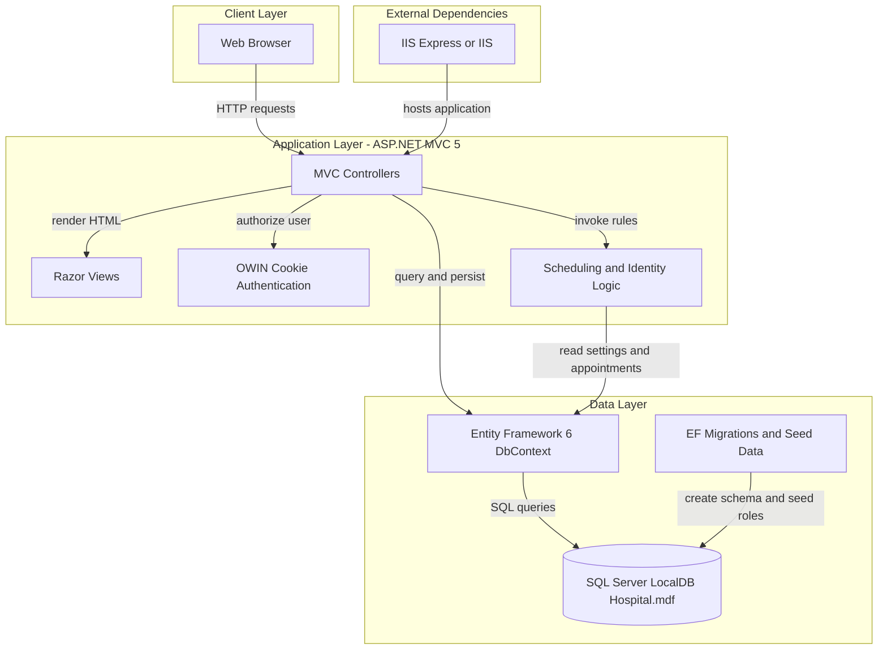
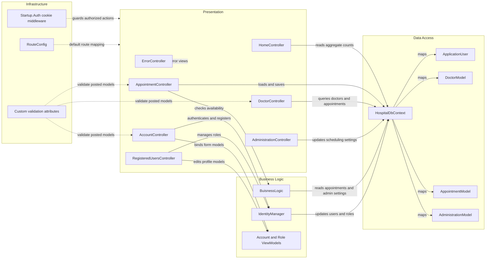

# Architecture Diagram

This application is a single deployable ASP.NET MVC 5 web application that serves browser-based pages for patients, doctors, and administrators. Its runtime centers on MVC controllers, OWIN cookie authentication, and Entity Framework 6 over a local SQL Server database file.

## Application Architecture

### Technology Stack Summary

| Layer | Technology | Version | Purpose |
|---|---|---:|---|
| Presentation | ASP.NET MVC | 5.2.0 | Server-rendered web UI and controller routing |
| Presentation | Razor / WebPages | 3.2.0 | View rendering |
| Security | OWIN Cookie Authentication | 2.1.0 | Forms-style sign-in and authentication cookies |
| Business Logic | Custom MVC controllers and `BuisnessLogic` helpers | Custom | Appointment scheduling, role flows, admin actions |
| Data Access | Entity Framework | 6.1.0 | ORM, migrations, identity persistence |
| Data Storage | SQL Server LocalDB | v11.0 configuration | Stores users, doctors, appointments, and admin settings |
| Hosting | IIS Express / IIS | n/a | Web application hosting |

### Data Storage & External Services

The application uses a single SQL Server LocalDB database attached from `|DataDirectory|\Hospital.mdf` and accessed through `HospitalDbContext`. No message broker, cache tier, external API, or dedicated observability service is configured in the repository; the only external runtime dependency evident in project metadata is the IIS-based web host.

### Key Architectural Decisions

- Uses a classic layered MVC pattern where controllers directly coordinate view rendering, validation, and persistence through `HospitalDbContext`.
- Centralizes appointment scheduling rules in `Models/BuisnessLogic.cs` instead of a separate service layer.
- Relies on ASP.NET Identity plus OWIN cookie middleware for authentication and role-based authorization.

## Component Relationships

### Component Inventory

| Component | Layer | Type | Responsibility |
|---|---|---|---|
| `HomeController` | Presentation | MVC Controller | Serves landing pages and appointment summary view |
| `AccountController` | Presentation | MVC Controller | Login, register, password management, sign-out |
| `AppointmentController` | Presentation | MVC Controller | Appointment CRUD and availability lookup |
| `DoctorController` | Presentation | MVC Controller | Doctor directory, availability, and appointment history |
| `RegisteredUsersController` | Presentation | MVC Controller | Admin user maintenance and role assignment |
| `AdministrationController` | Presentation | MVC Controller | Admin maintenance of scheduling settings |
| `ErrorController` | Presentation | MVC Controller | Error and HTTP status views |
| `BuisnessLogic` | Business Logic | Helper class | Working-hours, clash detection, and slot generation |
| `IdentityManager` | Business Logic | Helper class | Role creation, role assignment, and user creation |
| `HospitalDbContext` | Data Access | EF6 DbContext | Identity and domain persistence boundary |
| `ApplicationUser` | Data Access | Entity | Patient and admin identity profile with appointments |
| `DoctorModel` | Data Access | Entity | Doctor profile and appointment ownership |
| `AppointmentModel` | Data Access | Entity | Appointment booking record between user and doctor |
| `AdministrationModel` | Data Access | Entity | Configurable appointment duration and work hours |
| `Startup.Auth` | Infrastructure | Middleware configuration | Configures application cookie authentication |
| Custom validation attributes | Infrastructure | Validation filters | Reject future birth dates and past appointments |
| `RouteConfig` | Infrastructure | Routing configuration | Registers default `{controller}/{action}/{id}` pattern |
