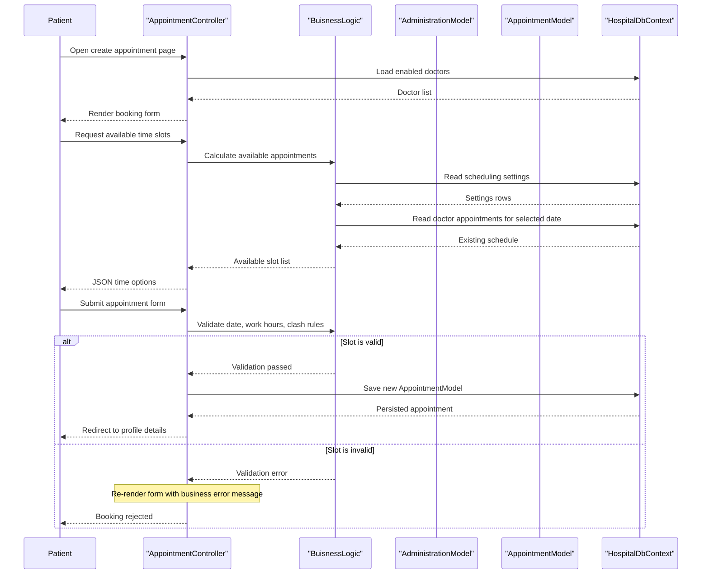

# Core Business Workflows

This application supports a hospital appointment domain where patients self-register, browse doctors, and book appointments while doctors and administrators manage schedules and access operational history. Administrative users also control doctor records, role assignments, and the scheduling rules that govern available time slots.

## Domain Entities

| Entity | Service / Bounded Context | Description | Key Relationships |
|---|---|---|---|
| `ApplicationUser` | Identity and Patient Management | Registered user profile used for patients and administrators | Books appointments and belongs to one or more roles |
| `DoctorModel` | Doctor Management | Doctor directory entry with department and degree | Owns many appointments |
| `AppointmentModel` | Appointment Scheduling | Booking record linking a patient, doctor, date, and time | Connects one patient to one doctor at one slot |
| `AdministrationModel` | Administration | Configurable scheduling parameters such as workday start and duration | Drives appointment availability rules |
| Roles (`Admin`, `Doctor`, `Patient`) | Access Control | Determines which workflows each user can execute | Assigned to users during registration or admin maintenance |

## Service-to-Domain Mapping

| Service | Domain Context | Owned Entities | External Dependencies |
|---|---|---|---|
| DoctorPatient web app | Identity and Access | `ApplicationUser`, roles, claims | ASP.NET Identity and OWIN cookie auth |
| DoctorPatient web app | Appointment Scheduling | `AppointmentModel`, `AdministrationModel` | Entity Framework queries against shared DB |
| DoctorPatient web app | Doctor Directory | `DoctorModel` | Entity Framework queries against shared DB |

## Primary Workflows

### Workflow 1: Patient registration and sign-in

Anonymous users open the registration page, submit `RegisterViewModel`, and create an `ApplicationUser` through `UserManager`. The application immediately adds the new user to the `Patient` role, signs them in with an authentication cookie, and redirects them to the home page. During sign-in, blocked users are explicitly prevented from authenticating even if their credentials are valid.

### Workflow 2: Patient books an appointment

Patients open the appointment creation page, which loads doctors that still accept new appointments. The browser then calls the JSON availability endpoint for a selected doctor and date; `BuisnessLogic` computes slots using configured start hour, end hour, duration, weekend exclusion, and existing bookings. On form submission, the application re-checks working hours and double-booking rules before saving the appointment and redirecting to the patient details page.

### Workflow 3: Doctor or admin reviews appointment history

Doctors and administrators open upcoming or historical appointment pages. The controller resolves the correct doctor either by numeric identifier or by matching the signed-in doctor username to a doctor name, loads the appointment list, optionally filters by patient name, sorts the appointments, and renders the view.

### Workflow 4: Administrator maintains doctors, users, roles, and scheduling rules

Administrators can create and edit doctor records, update scheduling parameters in `AdministrationModel`, edit user profiles, delete users, and manage role assignments. Role changes clear existing assignments before applying the newly selected role set.

## Cross-Service Data Flows

There are no separate services in this codebase, so business data composition happens within one process and one database. The most notable flow is appointment booking, where the UI calls `GetAvailableAppointments`, the controller delegates to `BuisnessLogic`, and that logic combines administrative scheduling settings with doctor-specific appointment data to produce the final list of selectable slots.

Because all contexts share one database, there is no circuit breaker or remote fallback behavior. If the shared database or its seed data is unavailable, registration, appointment booking, doctor lookups, and admin settings all fail together.

## Business Workflow Sequence

## Business Rules & Decision Logic

- **Validation rules**
  - Birth dates must be in the past for doctors and users.
  - Appointment dates cannot be in the past.
  - Password confirmation must match on registration and password change.
- **Scheduling rules**
  - Appointments are only available on weekdays.
  - Available slots are bounded by admin-configured start hour, end hour, and duration.
  - A doctor cannot have overlapping appointments for the same time slot.
  - Doctors flagged with `DisableNewAppointments` are excluded from new booking options.
- **Authorization rules**
  - Admin-only actions protect doctor creation, admin settings, and role management.
  - Patient-only booking is enforced for appointment creation.
  - Blocked users are denied login even with valid credentials.
- **State and integrity behavior**
  - New users are automatically assigned the `Patient` role after registration.
  - Role reassignment clears old roles before applying the selected set.
  - Appointment persistence depends on both UI validation and runtime schedule checks against current database state.
