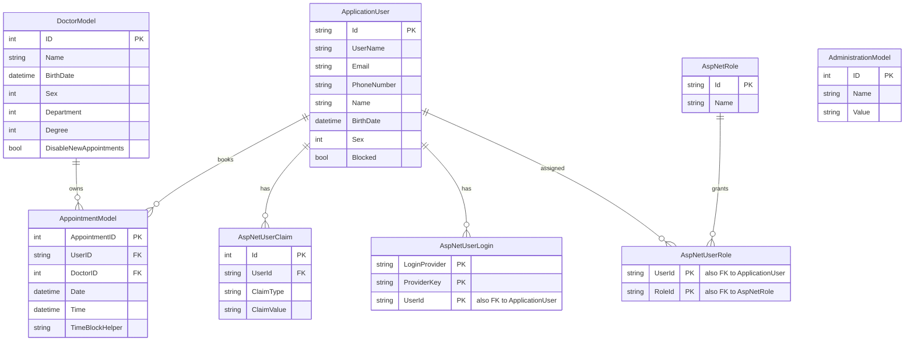

# Data Architecture & Persistence Layer

The data layer is centered on a single Entity Framework 6 `HospitalDbContext` backed by SQL Server LocalDB. It manages four core application entities plus the ASP.NET Identity tables used for authentication, authorization, and user profile storage.

## Database Configuration

| Service/Module | DB Type | Profile | Driver | Connection | Migration Tool |
|---|---|---|---|---|---|
| DoctorPatient | SQL Server LocalDB | Default web configuration | `System.Data.SqlClient` via EF provider | `Data Source=(LocalDb)\v11.0;AttachDbFilename=|DataDirectory|\Hospital.mdf;Integrated Security=True;MultipleActiveResultSets=true` | Entity Framework Code First Migrations |

## Data Ownership per Service

| Service | Tables Owned | ORM Framework | Caching | Notes |
|---|---|---|---|---|
| DoctorPatient | `AdministrationModels`, `AppointmentModels`, `DoctorModels`, `AspNetUsers`, `AspNetRoles`, `AspNetUserRoles`, `AspNetUserClaims`, `AspNetUserLogins` | Entity Framework 6 with ASP.NET Identity EF stores | None | Single shared database for application and identity data |

## Entity Model

## Key Repository Methods

| Service | Repository | Notable Methods | Purpose |
|---|---|---|---|
| DoctorPatient | `HospitalDbContext` via controllers | `DbSet.Find(id)` in multiple controllers | Loads doctors, appointments, admin settings, and users by primary key |
| DoctorPatient | `HospitalDbContext` via LINQ queries | `db.Appointments.Include(a => a.Doctor).OrderByDescending(...)` | Retrieves appointment lists with doctor navigation data |
| DoctorPatient | `HospitalDbContext` via LINQ queries | `db.Doctors.Where(...)` | Filters available doctors by department, name, and disabled flag |
| DoctorPatient | `HospitalDbContext` via LINQ queries | `db.ApplicationUsers.First(u => u.UserName == id)` | Resolves identity records by username for profile and role management |
| DoctorPatient | `BuisnessLogic` on top of `HospitalDbContext` | `ValidateNoAppoinmentClash`, `AvailableAppointments` | Reads appointments and admin settings to enforce scheduling rules |
| DoctorPatient | `IdentityManager` on top of ASP.NET Identity stores | `CreateRole`, `CreateUser`, `AddUserToRole`, `ClearUserRoles` | Manages persistence of roles and user-role assignments |

## Caching Strategy

No caching layer was detected. The repository does not use `MemoryCache`, Redis, `System.Runtime.Caching`, or Entity Framework second-level cache packages. Reads appear to go directly from controller or helper logic to Entity Framework and the LocalDB database each time.

## Data Ownership Boundaries

The application uses a single shared relational database for all functional areas, including identity, appointments, doctor profiles, and administrative scheduling settings. There are no separate services or isolated schemas, so all cross-domain access happens as in-process Entity Framework queries against the same `HospitalDbContext`.

Read and write behavior is straightforward CRUD with synchronous writes through EF. Appointment scheduling reads `AdministrationModel` for business settings and `AppointmentModel` for existing bookings before inserting a new appointment, so the application relies on application-layer checks rather than explicit CQRS or cross-service aggregation patterns.

### Data Classification & Sensitivity

| Entity | Sensitive Fields | Classification (PII/PHI/PCI/None) | Controls in Place |
|---|---|---|---|
| `ApplicationUser` | `Name`, `BirthDate`, inherited `Email`, `PhoneNumber`, `UserName` | PII | Passwords are hashed by ASP.NET Identity, but no masking or encryption-at-rest configuration is present |
| `DoctorModel` | `Name`, `BirthDate` | PII | No masking or encryption-at-rest configuration detected |
| `AppointmentModel` | `UserID`, `DoctorID`, `Date`, `Time` | PII | No masking or encryption-at-rest configuration detected |
| `AdministrationModel` | none | None | n/a |
| Identity role and claim tables | role names, claims, login provider identifiers | Potentially sensitive auth metadata | Managed through ASP.NET Identity, no explicit masking detected |
