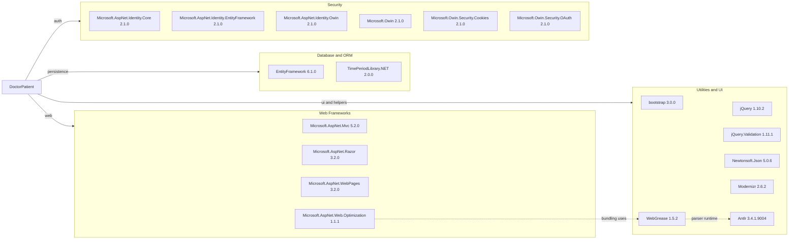

# Dependency Map

This project declares 29 NuGet dependencies for a single ASP.NET MVC web application targeting .NET Framework 4.5. The dependency set is concentrated around the legacy ASP.NET MVC stack, Entity Framework, ASP.NET Identity, and front-end browser assets.

## Dependencies

### Dependency Summary

| Category | Count | Key Libraries | Notes |
|---|---:|---|---|
| Web Frameworks | 4 | ASP.NET MVC, Razor, WebPages, Web.Optimization | Legacy System.Web MVC stack on .NET Framework |
| Database / ORM | 2 | EntityFramework, TimePeriodLibrary.NET | EF6 plus helper library used in scheduling calculations |
| Security | 12 | ASP.NET Identity, OWIN, OWIN Security packages | Cookie auth and role management with many incompatible upgrade-era packages |
| Utilities | 11 | bootstrap, jQuery, Newtonsoft.Json, Modernizr | Front-end assets and support libraries dominate the remainder |

### Version & Compatibility Risks

The project targets .NET Framework 4.5 and depends on several packages that are both outdated and flagged by restore-time vulnerability warnings, including `bootstrap 3.0.0`, `jQuery 1.10.2`, `jQuery.Validation 1.11.1`, `Microsoft.Owin 2.1.0`, and `Newtonsoft.Json 5.0.6`. The upgrade assessment also marks core System.Web, OWIN, and ASP.NET Identity packages as incompatible with a direct move to modern .NET.

### Notable Observations

- The authentication stack is spread across multiple closely related OWIN and ASP.NET Identity packages, increasing migration complexity.
- No dedicated logging, messaging, caching, or observability packages are declared in the build metadata.
- Several libraries are front-end era packages typically handled today by static asset pipelines rather than NuGet-delivered web assets.
- `Microsoft.AspNet.Web.Optimization` depends on `WebGrease` and `Antlr`, adding legacy bundling infrastructure that modern ASP.NET Core apps do not keep.

## Test Dependencies

| Framework | Version | Notes |
|---|---:|---|
| None detected | n/a | `packages.config` contains no test-scoped packages and the repository has no test project |

Total test-scope dependencies: 0

No test dependencies were declared in the repository. This aligns with the absence of a test project and means there is no built-in unit or integration test infrastructure to support migration verification.
